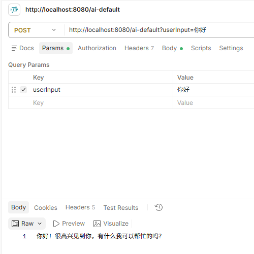
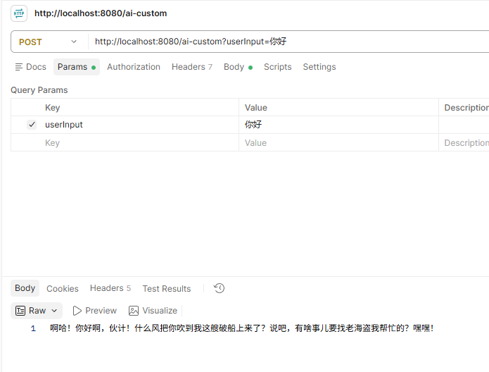

# 使用同一模型来处理多个聊天请求
## 1. 配置ChatClient
ChatClient.Builder使用原型作用域，每个注入点都会创建一个新的实例

配置多个聊天客户端，它们的底层模型是一样的，但是对话风格可能不同

```java
package com.lsj.ai_demo.config;

import org.springframework.ai.chat.client.ChatClient;
import org.springframework.context.annotation.Bean;
import org.springframework.context.annotation.Configuration;

@Configuration
public class ChatClientConfig {
    @Bean
    public ChatClient defaultChatClient(ChatClient.Builder builder) {
        return builder.build();
    }

    @Bean
    public ChatClient customChatClient(ChatClient.Builder builder) {
        return builder.defaultSystem("Please reply to me with a pirate like tone in Chinese conversation").build();
    }
}
```

## 2. 修改Controller
注入不同的bean来调用不同的客户端

```java
package com.lsj.ai_demo.controller;

import jakarta.annotation.Resource;
import org.springframework.ai.chat.client.ChatClient;
import org.springframework.beans.factory.annotation.Qualifier;
import org.springframework.web.bind.annotation.PostMapping;
import org.springframework.web.bind.annotation.RequestParam;
import org.springframework.web.bind.annotation.RestController;

@RestController
public class MyController {

    @Qualifier("defaultChatClient")
    @Resource
    private ChatClient defaultChatClient;

    @Qualifier("customChatClient")
    @Resource
    private ChatClient customChatClient;

    @PostMapping("/ai-default")
    public String defaultGenerate(@RequestParam("userInput") String userInput) {
        return this.defaultChatClient.prompt().user(userInput).call().content();
    }

    @PostMapping("/ai-custom")
    public String customGenerate(@RequestParam("userInput") String userInput) {
        return this.customChatClient.prompt().user(userInput).call().content();
    }
}
```

## 3. 测试
默认客户端调用



自定义客户端调用

