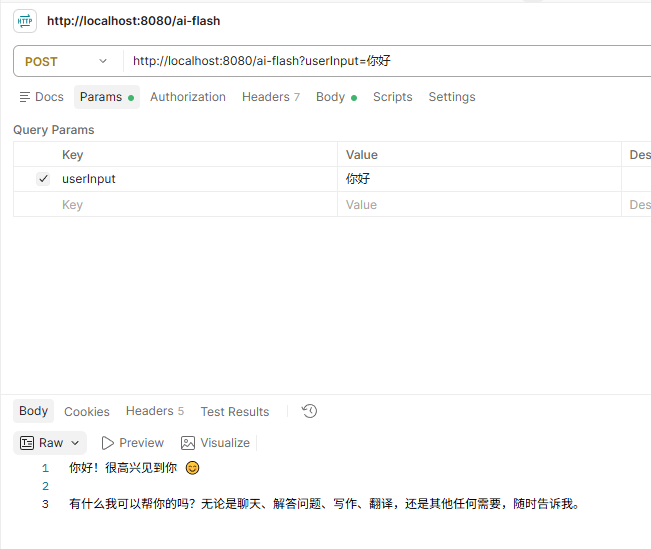
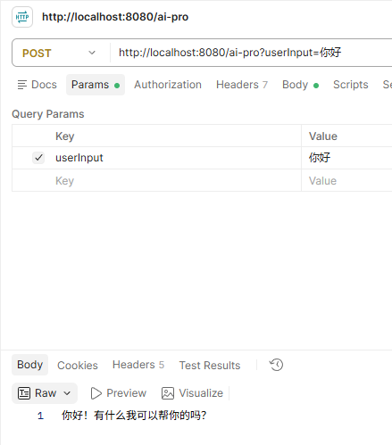
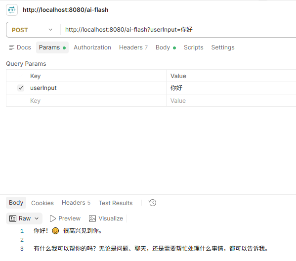
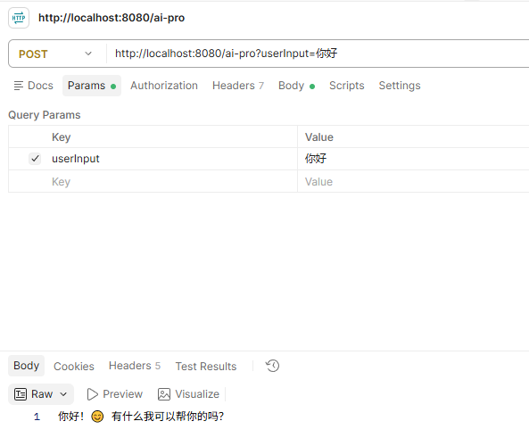

# 使用同一模型的不同型号
有两种方法：
1. 使用同一个ChatClient，在请求时指定模型名称
2. 使用不同的ChatClient，在构建时指定模型名称

## 使用同一个ChatClient
### 1. 指定model
直接在客户端请求的时候通过`OpenAiChatOptions`来指定名称

```java
@RestController
public class MyController {

    private final ChatClient chatClient;

    public MyController(ChatClient.Builder chatClient) {
        this.chatClient = chatClient.build();
    }

    @PostMapping("/ai-flash")
    public String generateByFlash(@RequestParam("userInput") String userInput) {
        return this.chatClient.prompt().options(OpenAiChatOptions.builder().model("deepseek-flash")).user(userInput).call().content();
    }

    @PostMapping("/ai-pro")
    public String generateByPro(@RequestParam("userInput") String userInput) {
        return this.chatClient.prompt().options(OpenAiChatOptions.builder().model("deepseek-v4-pro")).user(userInput).call().content();
    }
}
```

### 2. 测试




## 使用不同的ChatClient
### 1. 配置ChatClient
```java
@Configuration
public class ChatClientConfig {
    @Bean
    public ChatClient flashChatClient(ChatClient.Builder builder) {
        return builder.defaultOptions(OpenAiChatOptions.builder().model("deepseek-flash")).build();
    }

    @Bean
    public ChatClient proChatClient(ChatClient.Builder builder) {
        return builder.defaultOptions(OpenAiChatOptions.builder().model("deepseek-v4-pro")).build();
    }
}
```

### 2. 使用不同的ChatClient调用
```java
@RestController
public class MyController {

    @Resource
    private ChatClient flashChatClient;

    @Resource
    private ChatClient proChatClient;

    @PostMapping("/ai-flash")
    public String generateByFlash(@RequestParam("userInput") String userInput) {
        return flashChatClient.prompt().user(userInput).call().content();
    }

    @PostMapping("/ai-pro")
    public String generateByPro(@RequestParam("userInput") String userInput) {
        return proChatClient.prompt().user(userInput).call().content();
    }
}
```

### 3. 测试



