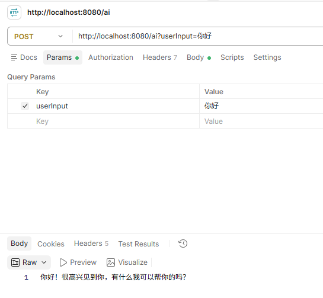

# 一个简单的ai对话
## 1. 新建Spring Boot项目
官方网址：[https://start.spring.io/](https://start.spring.io/)

版本选择Spring Boot 4.1.1，JDK21

## 2. maven配置
按照[https://docs.spring.io/spring-ai/reference/getting-started.html](https://docs.spring.io/spring-ai/reference/getting-started.html)的教程配置好maven

并引入如下依赖：
```xml
<dependency>
    <groupId>org.springframework.ai</groupId>
    <artifactId>spring-ai-client-chat</artifactId>
</dependency>

<dependency>
    <groupId>org.springframework.ai</groupId>
    <artifactId>spring-ai-starter-model-openai</artifactId>
</dependency>
```

其中`spring-ai-client-chat`负责配置客户端，`spring-ai-starter-model-openai`负责集成兼容openai的模型

## 3. 配置application.yml
spring-ai是通过配置文件中的配置来决定自动注入的模型的

```yml
spring:
  application:
    name: ai-demo
  ai:
    openai:
      api-key: ${DEEPSEEK_API_KEY}
      base-url: https://api.deepseek.com
      chat:
        options:
          model: deepseek-chat

```

这里选择的deepseek作为默认的模型厂商，以上配置spring boot会将请求自动拼接成`https://api.deepseek.com/v1/chat/completions`

- api-key：deepseek开放平台中申请的api-key，通过`setx DEEPSEEK_API_KEY "sk-你的key"`命令来将key配置到环境变量中，注意set后要重启IDEA
- base-url：deepseek的请求url
- model：deepseek模型，`deepseek-chat`为对话模型，`deepseek-reasoner`为推理模型

## 4. 编写Controller
通过构造器注入ChatClient

```java
@RestController
public class MyController {
    private final ChatClient chatClient;

    public MyController(ChatClient.Builder chatClient) {
        this.chatClient = chatClient.build();
    }

    @PostMapping("/ai")
    public String generate(@RequestParam("userInput") String userInput) {
        return this.chatClient.prompt().user(userInput).call().content();
    }
}
```

## 5. 测试
通过Postman调用`http://localhost:8080/ai?userInput=hello`

如果出现模型回复，则表示demo成功了

