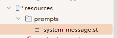

# 使用资源而非原始字符串
有时候希望从文件中加载提示词，而不是通过输入的方式加载，则可以使用`org.springframework.core.io.Resource`类来加载提示词

代码示例：
```java
@RestController
public class MyController {
    private final ChatModel chatModel;

    @Value("classpath:/prompts/system-message.st")
    private Resource systemResource;

    public MyController(ChatModel chatModel) {
        this.chatModel = chatModel;
    }

    @PostMapping("/ai")
    public String generate() {
        SystemPromptTemplate systemPromptTemplate = new SystemPromptTemplate(systemResource);
        Message systemMessage = systemPromptTemplate.createMessage();
        return chatModel.call(systemMessage);
    }

}
```

system-message.st内容：
```text
Your name is EVA.
```



测试：
