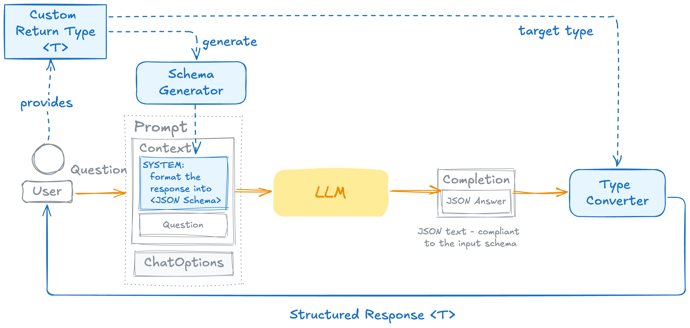
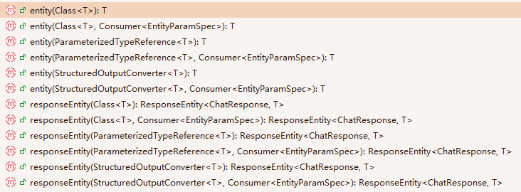

# 让模型以结构化的形式输出
使用`ChatClient`的`entity()`方法来让模型按照指定类的格式输出

其背后原理为：


结构化输出有如下几种方法：


其中：
- Class<T>：以指定类的格式输出
- ParameterizedTypeReference\<T>：以通用类型，比如List、Map的格式输出
- StructuredOutputConverter\<T>：以自定义结构化输出器的格式输出
- Consumer\<EntityParamSpec>：为可靠性开关，其中两个主要的方法为：
  - validateSchema()：启动了自我纠正的重试循环，如果验证输出格式失败，不会报错，而是会把错误信息附加到返回中
  - useProviderStructuredOutput()：在API层面约束模型

而`entity()`和`responseEntity()`的区别则为前者仅输出对话内容，后者包含完整回复，比如token的消耗、元数据等信息

## Class\<T>
ActorFilms：
```java
public record ActorFilms(String actor, List<String> movies) {
}
```

MyController：
```java
@RestController
public class MyController {
    private final ChatClient chatClient;

    public MyController(ChatClient.Builder builder) {
        this.chatClient = builder.defaultOptions(OpenAiChatOptions.builder().temperature(0.7d)).build();
    }

    @PostMapping("/ai")
    public ActorFilms generate() {
        return chatClient.prompt()
                .user("Generate five filmography for a random actor.")
                .call()
                .entity(ActorFilms.class);
    }

}
```

测试模型输出结果：
```text
{
    "actor": "Keanu Reeves",
    "movies": [
        "Youngblood",
        "River's Edge",
        "Permanent Record",
        "Dangerous Liaisons",
        "Bill & Ted's Excellent Adventure"
    ]
}
```

## ParameterizedTypeReference\<T>
```java
@RestController
public class MyController {
    private final ChatClient chatClient;

    public MyController(ChatClient.Builder builder) {
        this.chatClient = builder.defaultOptions(OpenAiChatOptions.builder().temperature(0.7d)).build();
    }

    @PostMapping("/ai")
    public List<ActorFilms> generate() {
        return chatClient.prompt()
                .user("Generate movies with three random actors, each with five movies")
                .call()
                .entity(new ParameterizedTypeReference<List<ActorFilms>>() {
                });
    }

}
```

测试模型输出结果：
```text
[
    {
        "actor": "Leonardo DiCaprio",
        "movies": [
            "Titanic",
            "Inception",
            "The Wolf of Wall Street",
            "The Revenant",
            "Catch Me If You Can"
        ]
    },
    {
        "actor": "Meryl Streep",
        "movies": [
            "The Devil Wears Prada",
            "Sophie's Choice",
            "Kramer vs. Kramer",
            "The Iron Lady",
            "Doubt"
        ]
    },
    {
        "actor": "Denzel Washington",
        "movies": [
            "Training Day",
            "Malcolm X",
            "Glory",
            "The Equalizer",
            "Flight"
        ]
    }
]
```

## Consumer\<EntityParamSpec>
`validateSchema()`和`useProviderStructuredOutput()`既可以独立使用，也可以结合使用

```java
@RestController
public class MyController {
    private final ChatClient chatClient;

    public MyController(ChatClient.Builder builder) {
        this.chatClient = builder.defaultOptions(OpenAiChatOptions.builder().temperature(0.7d)).build();
    }

    @PostMapping("/ai")
    public ActorFilms generate() {
        return chatClient.prompt()
                .user("Generate five filmography for a random actor.")
                .call()
                .entity(ActorFilms.class, spec -> spec.validateSchema().useProviderStructuredOutput());
    }

}
```

测试模型输出结果：
```text
{
    "actor": "Tom Hanks",
    "movies": [
        "Forrest Gump",
        "Saving Private Ryan",
        "Cast Away",
        "The Green Mile",
        "Toy Story"
    ]
}
```

注意以上两个方法中`validateSchema()`是不限制模型的

而`useProviderStructuredOutput()`需要底层模型支持原生结构化输出，目前只有如下模型厂商支持：
- OpenAI
- Anthropic
- Google GenAI
- Mistral AI
- Ollama

如果模型不支持原生结构化输出，则调用会报错：
```text
com.openai.errors.BadRequestException: 400: This response_format type is unavailable now (request_id: ea275f90-feb2-4e63-8de8-9078fc41a86b)
	at com.openai.errors.BadRequestException$Builder.build(BadRequestException.kt:98) ~[openai-java-core-4.39.1.jar:4.39.1]
	at com.openai.core.handlers.ErrorHandler$errorHandler$1.handle(ErrorHandler.kt:54) ~[openai-java-core-4.39.1.jar:4.39.1]
	at com.openai.core.handlers.ErrorHandler$errorHandler$1.handle(ErrorHandler.kt:46) ~[openai-java-core-4.39.1.jar:4.39.1]
	at com.openai.services.blocking.chat.ChatCompletionServiceImpl$WithRawResponseImpl.create(ChatCompletionServiceImpl.kt:141) ~[openai-java-core-4.39.1.jar:4.39.1]
	at com.openai.services.blocking.chat.ChatCompletionServiceImpl.create(ChatCompletionServiceImpl.kt:63) ~[openai-java-core-4.39.1.jar:4.39.1]
	at com.openai.services.blocking.chat.ChatCompletionService.create(ChatCompletionService.kt:64) ~[openai-java-core-4.39.1.jar:4.39.1]
	at org.springframework.ai.openai.OpenAiChatModel.lambda$internalCall$2(OpenAiChatModel.java:217) ~[spring-ai-openai-2.0.0.jar:2.0.0]
	at io.micrometer.observation.Observation.observe(Observation.java:634) ~[micrometer-observation-1.17.1.jar:1.17.1]
```

## StructuredOutputConverter\<T>
使用自定义的结构化输出转换器，具体见另一章节

## responseEntity()
```java
@RestController
public class MyController {
    private final ChatClient chatClient;

    public MyController(ChatClient.Builder builder) {
        this.chatClient = builder.defaultOptions(OpenAiChatOptions.builder().temperature(0.7d)).build();
    }

    @PostMapping("/ai")
    public ResponseEntity<ChatResponse, ActorFilms> generate() {
        return chatClient.prompt()
                .user("Generate five filmography for a random actor.")
                .call()
                .responseEntity(ActorFilms.class, spec -> spec.validateSchema());
    }

}
```

模型输出结果：
```text
{
    "response": {
        "metadata": {
            "empty": false,
            "id": "606de9f3-9850-4452-af39-db362bf61c02",
            "model": "deepseek-flash",
            "promptMetadata": [],
            "rateLimit": {
                "requestsLimit": 0,
                "requestsRemaining": 0,
                "requestsReset": "PT0S",
                "tokensLimit": 0,
                "tokensRemaining": 0,
                "tokensReset": "PT0S"
            },
            "usage": {
                "promptTokens": 245,
                "completionTokens": 170,
                "totalTokens": 415,
                "cacheReadInputTokens": 0,
                "nativeUsage": {
                    "completion_tokens": 170,
                    "prompt_tokens": 245,
                    "total_tokens": 415,
                    "completion_tokens_details": {
                        "reasoning_tokens": 131,
                        "valid": true
                    },
                    "prompt_tokens_details": {
                        "cached_tokens": 0,
                        "valid": true
                    },
                    "valid": true,
                    "prompt_cache_hit_tokens": 0,
                    "prompt_cache_miss_tokens": 245
                }
            }
        },
        "result": {
            "metadata": {
                "contentFilters": [],
                "empty": true,
                "finishReason": "STOP"
            },
            "output": {
                "media": [],
                "messageType": "ASSISTANT",
                "metadata": {
                    "role": "assistant",
                    "messageType": "ASSISTANT",
                    "finishReason": "STOP",
                    "refusal": "",
                    "annotations": [
                        {}
                    ],
                    "index": 0,
                    "id": "606de9f3-9850-4452-af39-db362bf61c02",
                    "reasoningContent": "We need answer JSON only no markdown. Need generate five filmography for random actor. Schema actor string, movies array strings. Need exactly five? \"five filmography\" likely five movies. Random actor. We can pick actor. Need ensure valid JSON RFC8259. No explanations. Output object with actor and movies array of 5 strings. Probably actor random e.g. \"Meryl Streep\" movies: \"The Deer Hunter\", \"Kramer vs. Kramer\", \"Sophie's Choice\", \"The Devil Wears Prada\", \"The Iron Lady\". That's five. Need no extra. Ensure valid JSON. Final only. "
                },
                "text": "{\"actor\":\"Meryl Streep\",\"movies\":[\"The Deer Hunter\",\"Kramer vs. Kramer\",\"Sophie's Choice\",\"The Devil Wears Prada\",\"The Iron Lady\"]}",
                "toolCalls": []
            }
        },
        "results": [
            {
                "metadata": {
                    "contentFilters": [],
                    "empty": true,
                    "finishReason": "STOP"
                },
                "output": {
                    "media": [],
                    "messageType": "ASSISTANT",
                    "metadata": {
                        "role": "assistant",
                        "messageType": "ASSISTANT",
                        "finishReason": "STOP",
                        "refusal": "",
                        "annotations": [
                            {}
                        ],
                        "index": 0,
                        "id": "606de9f3-9850-4452-af39-db362bf61c02",
                        "reasoningContent": "We need answer JSON only no markdown. Need generate five filmography for random actor. Schema actor string, movies array strings. Need exactly five? \"five filmography\" likely five movies. Random actor. We can pick actor. Need ensure valid JSON RFC8259. No explanations. Output object with actor and movies array of 5 strings. Probably actor random e.g. \"Meryl Streep\" movies: \"The Deer Hunter\", \"Kramer vs. Kramer\", \"Sophie's Choice\", \"The Devil Wears Prada\", \"The Iron Lady\". That's five. Need no extra. Ensure valid JSON. Final only. "
                    },
                    "text": "{\"actor\":\"Meryl Streep\",\"movies\":[\"The Deer Hunter\",\"Kramer vs. Kramer\",\"Sophie's Choice\",\"The Devil Wears Prada\",\"The Iron Lady\"]}",
                    "toolCalls": []
                }
            }
        ]
    },
    "entity": {
        "actor": "Meryl Streep",
        "movies": [
            "The Deer Hunter",
            "Kramer vs. Kramer",
            "Sophie's Choice",
            "The Devil Wears Prada",
            "The Iron Lady"
        ]
    }
}
```

可以看到，模型输出中包含了完整的对话信息