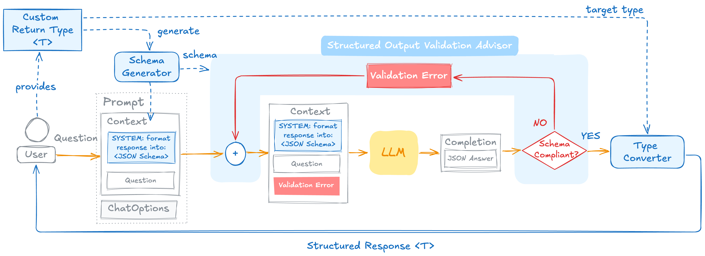

# 模式验证与自我纠正
## 工作原理
默认的`entity()`调用要求模型生成与指定格式相同的输出，但无法强制执行，模型仍然会输出额外字段或者省略字段，而使用`validateSchema()`则要求Spring框架对模型给出的回复进行验证，如果验证不通过则会将错误信息附加在回复中并默认重试3次

处理错误输出最简单的方式就是检测并重试，通过`Consumer\<EntityParamSpec>`来达成这一效果

其背后的原理为：
1. 模型响应
2. Spring AI框架对模型响应做出验证
3. 如果通过则直接返回
4. 如果不通过，则将缺失的或多余的字段附加到提示词中，再次重试



重试由`StructuredOutputValidationAdvisor`驱动，这是一个自动注册的类，可直接使用

另外需要注意的是，`validateScheme`不能用于流式响应，因为它要对完整的回复进行验证

## 定制顾问
可以通过自定义`StructuredOutputValidationAdvisor`来定制顾问，其中：
- outputType()：定义输出格式，可以是类
- maxRepeatAttempts()：定义重试次数
- outputJsonSchema()：定义特定的json格式

例如：

ChatClient：
```java
@Configuration
public class ChatClientConfig {
    @Bean
    public ChatClient chatClient(ChatClient.Builder builder) {
        StructuredOutputValidationAdvisor advisor = StructuredOutputValidationAdvisor.builder()
                .outputType(ActorFilms.class)
                .maxRepeatAttempts(5)
                .build();


        return builder.defaultOptions(OpenAiChatOptions.builder().model("deepseek-flash").temperature(0.7))
                .defaultAdvisors(advisor)
                .build();
    }
}
```

MyController：
```java
@RestController
public class MyController {
    @Resource
    private ChatClient chatClient;

    @PostMapping("/ai")
    public ActorFilms generate() {
        return chatClient.prompt()
                .user("生成随机一个演员及其出演的5部电影")
                .call()
                .entity(ActorFilms.class, spec -> spec.validateSchema());
    }

}
```

模型输出结果：
```text
{
    "actor": "Leonardo DiCaprio",
    "movies": [
        "Titanic",
        "Inception",
        "The Departed",
        "The Wolf of Wall Street",
        "The Revenant"
    ]
}
```

`outputType()`和`outputJsonSchema()`都可以用来定义自定义json格式，用法：
```java
var validationAdvisor = StructuredOutputValidationAdvisor.builder()
    .outputJsonSchema(myConverter.getJsonSchema())
    .build();
```

顾问背后的关键行为：
- 从预期输出类型（如类）中推导出json格式，或接受预定义的json字符串
- 通过`JSON Schema DRAFT_2020_12`验证模型响应格式是否符合要求
- 如果不符合要求则重试，默认重试3次
- 每次重试时会将错误信息附加到提示词中，帮助模型自我纠正
- 使用的总token量是所有重试累计的token，而不是只有单独一轮的token

## 与`useProviderStructuredOutput()`结合
`validateScheme()`是在Spring AI框架层面对结构化输出做的验证，即模型响应后

`useProviderStructuredOutput()`是在API层面，也就是调用模型层面做的验证，即调用模型前

二者有本质区别，可以结合使用，但是`useProviderStructuredOutput()`需要模型支持原生结构化输出